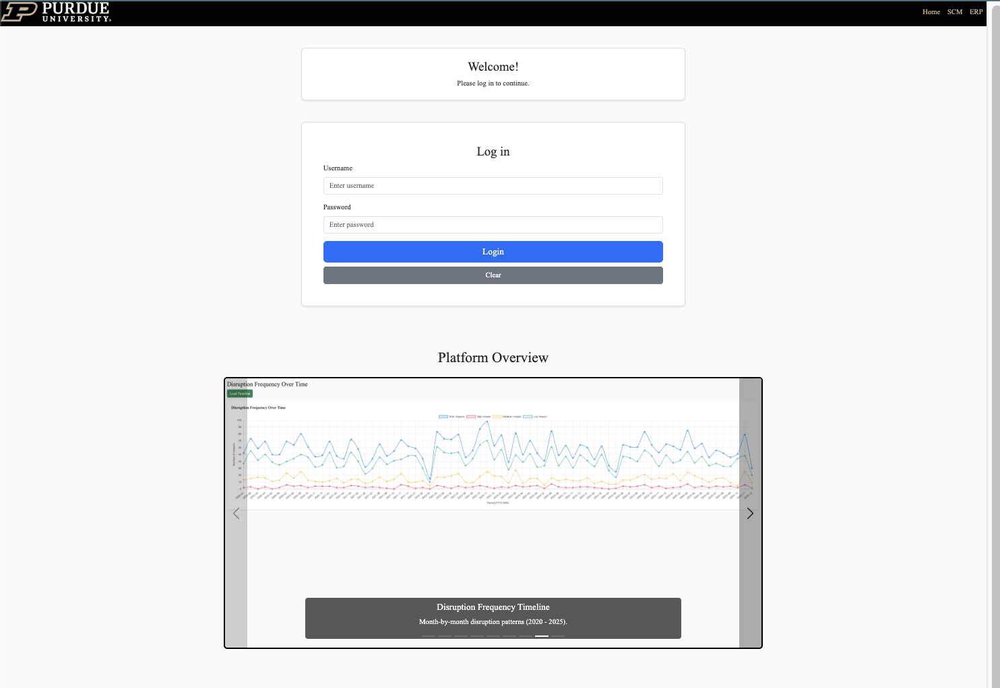
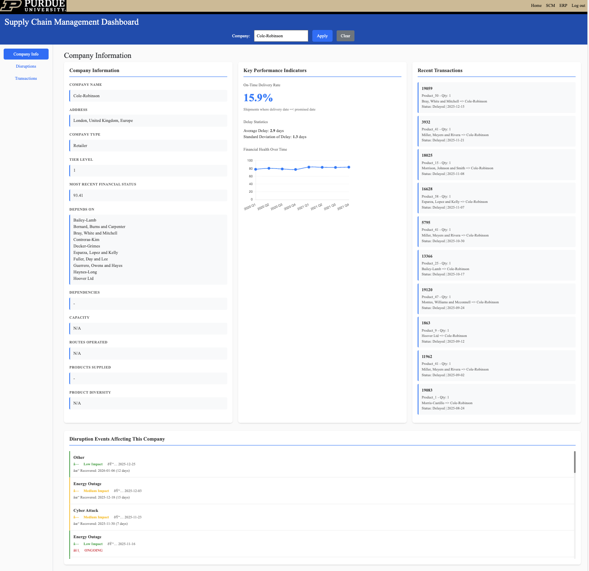
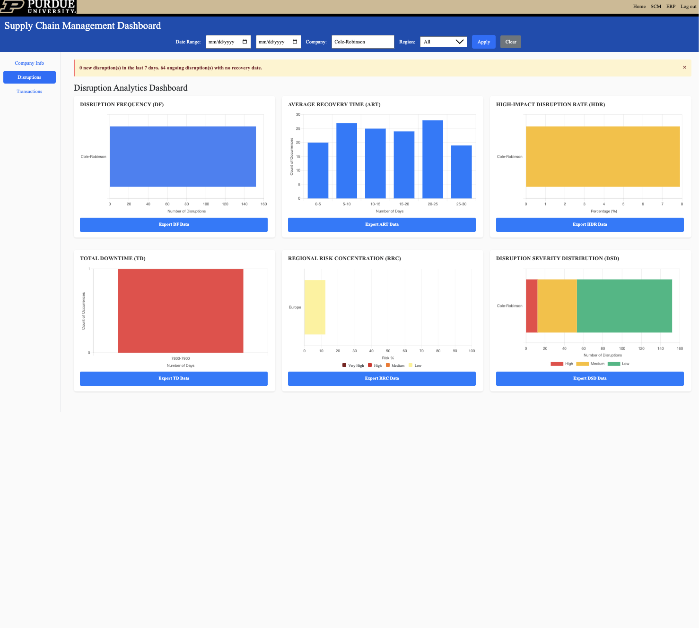
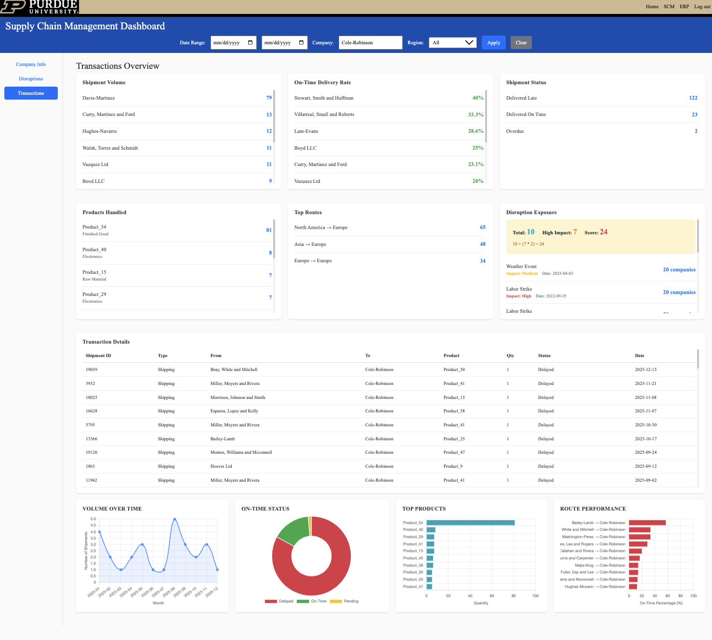
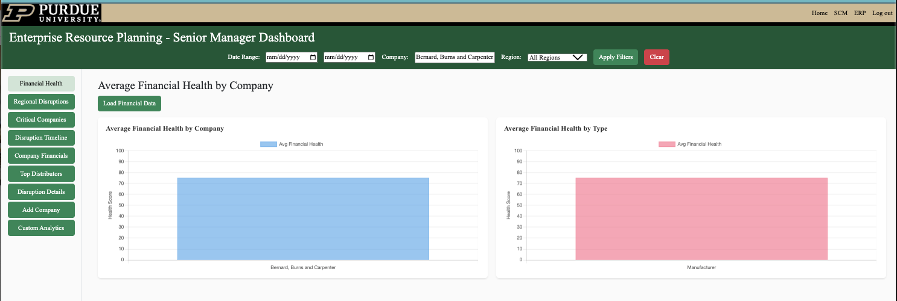
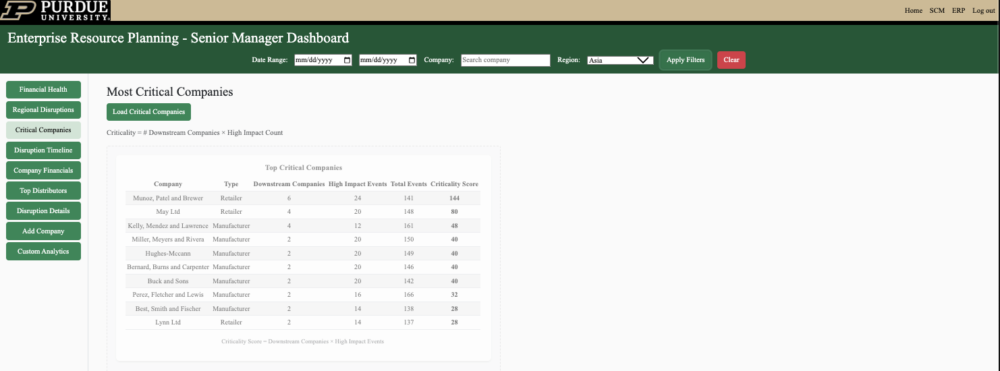
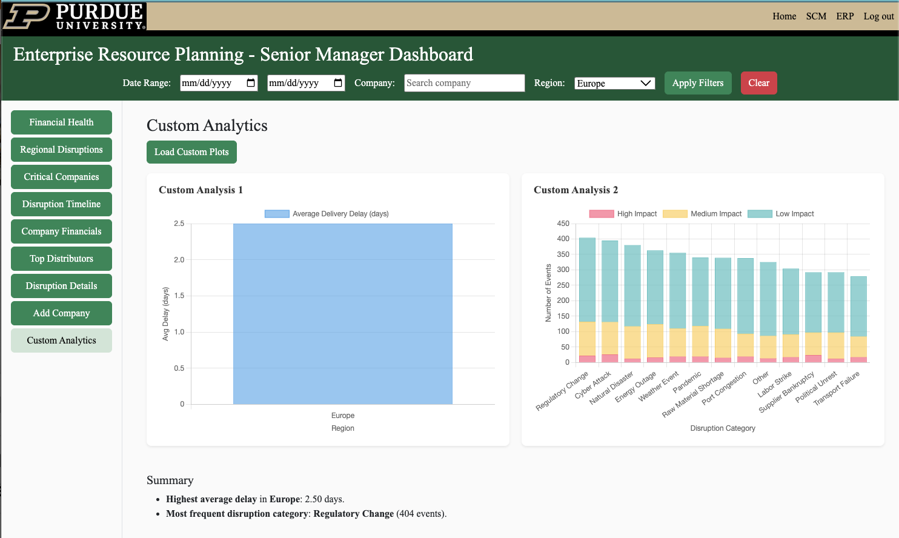
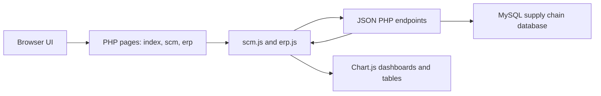

# Supply Chain Resilience Analytics Dashboard

A full-stack PHP and MySQL analytics application for exploring supplier risk, shipment reliability, disruption exposure, and financial health across a multi-tier supply chain network.

This project was built for Purdue IE332 as a role-based decision support system. It combines operational shipment data, disruption events, company relationships, and financial reports into interactive dashboards for supply chain managers and senior leadership.

This repository is preserved as a portfolio artifact. It is intended to show the structure, implementation approach, dashboard logic, and applied database work behind the project rather than represent a production ERP system.



## Project Overview

The application models a simplified enterprise reporting system connected to a relational database. Users log in through the main page and are routed to the appropriate dashboard based on their assigned role.

- **Senior managers** use an ERP-style dashboard for executive operating visibility.
- **Supply chain managers** use an SCM-style dashboard for supplier, distributor, shipment, and disruption analysis.
- Dashboard modules use SQL-backed filters, tables, and visualizations to support company, transaction, disruption, shipment, and financial analysis.

The project was designed around the kind of internal dashboard work industrial engineers may be asked to build, modify, or evaluate in practice: connecting database structure, user roles, filters, usability, and decision-relevant metrics in one system.

## Core Features

### Authentication and Role-Based Routing

- Login flow implemented with PHP sessions.
- Role-based routing for `SeniorManager` and `SupplyChainManager` users.
- Shared navbar and footer behavior based on login state.
- Logout flow to clear session state.

### Supply Chain Management Module

- Search company profiles by name.
- View company type, tier level, location, dependency relationships, product coverage, and recent transactions.
- Analyze shipment volume, delivery status, on-time delivery rate, average delay, and standard deviation of delay.
- Track financial health status and financial history for selected companies.
- Review disruption counts, disruption events, recovery behavior, regional risk, and disruption exposure.
- Export dashboard data for offline analysis.

### Senior Manager / ERP Module

- Compare average financial health by company, company type, and region.
- Summarize regional disruption levels and high-impact disruption counts.
- Rank critical companies using downstream dependency and high-impact disruption signals.
- Inspect disruption frequency over time.
- Identify top distributors by shipment volume and delivery delay.
- Look up affected companies by disruption event and all disruptions for a selected company.
- Add new companies through an ERP workflow.
- Run custom analytics across date, company, and region filters.

### Dashboard Interface

- Bootstrap-based responsive layout.
- Chart.js visualizations for operational and executive metrics.
- Shared PHP includes for consistent page structure.
- Modular PHP endpoints for SQL-backed dashboard data.
- Tables, filters, and cards designed for quick operational interpretation.

## Screenshots

| SCM Company Intelligence | SCM Disruption Analytics |
| --- | --- |
|  |  |

| SCM Transactions | ERP Financial Health |
| --- | --- |
|  |  |

| ERP Critical Companies | ERP Custom Analytics |
| --- | --- |
|  |  |

## Tech Stack

- **Backend:** PHP, MySQL, mysqli prepared statements for authentication and selected search endpoints
- **Frontend:** HTML, CSS, Bootstrap, Bootstrap Icons
- **Charts:** Chart.js
- **Data access:** JSON endpoints under `www/get_*.php` and `www/search_*.php`
- **Deployment model:** Traditional PHP web root with `www/` as the document root

## Architecture



More implementation detail is in [docs/ARCHITECTURE.md](docs/ARCHITECTURE.md).

## Implementation Highlights

- Separates layout into reusable PHP includes for the page head, navigation, and footer.
- Keeps dashboard behavior in external JavaScript files instead of embedding all logic in PHP templates.
- Uses dedicated JSON endpoints so dashboard widgets can load and refresh independently.
- Pushes aggregation work into SQL where practical for operational metrics such as delivery delay, disruption counts, financial averages, and shipment volume.
- Handles user session state consistently across login, role routing, protected dashboards, and logout.
- Includes static archived pages and screenshots so recruiters can review the visual outcome even without the original database.

## Repository Layout

```text
.
|-- www/                    # PHP application source and public web root
|   |-- index.php           # Landing page and login view
|   |-- scm.php             # Supply Chain Manager dashboard
|   |-- erp.php             # Senior Manager / ERP dashboard
|   |-- dbconnect.php       # Shared database connection loader
|   |-- scm.js              # SCM dashboard interactions and charts
|   |-- erp.js              # ERP dashboard interactions and charts
|   `-- get_*.php           # JSON data endpoints
|-- database/
|   `-- user_seed/          # Sanitized demo User table seed utilities
|-- docs/                   # Developer and architecture documentation
|   |-- ARCHITECTURE.md     # Runtime architecture and data flow notes
|   `-- PUBLICATION_CHECKLIST.md
|-- .github/                # Issue templates and pull request template
|-- site_archive/           # Static exported dashboard snapshots
`-- *.png                   # Portfolio screenshots used by this README
```

## Getting Started

### Prerequisites

- PHP 8.x with the `mysqli` extension enabled
- MySQL 8.x or a compatible MySQL server
- A populated database matching the tables used by the endpoints, including `User`, `Company`, `Location`, `Shipping`, `Product`, `FinancialReport`, `DisruptionEvent`, `DisruptionCategory`, and `ImpactsCompany`

### Configure the Database

Use either a local PHP config file or environment variables.

Option 1: local config file:

```bash
cp www/config.local.example.php www/config.local.php
```

Then edit `www/config.local.php` with your local database host, database name, username, and password. This file is ignored by git.

Option 2: environment variables:

```bash
export DB_HOST=localhost
export DB_PORT=3306
export DB_DATABASE=supply_chain_analytics
export DB_USERNAME=your_database_user
export DB_PASSWORD=your_database_password
```

Sanitized demo user seed utilities are available in [database/user_seed](database/user_seed). They use generic demo accounts and require you to set a local SQL session variable for the demo password before running the insert or update scripts.

### Run Locally

From the repository root:

```bash
php -S localhost:8000 -t www
```

Open `http://localhost:8000` in a browser.

If using MAMP, XAMPP, Apache, or another PHP stack, configure `www/` as the web root or place the project where the server can route requests into `www/index.php`.

## Demo and Archive Notes

The original application was dynamic and database-backed. Static HTML snapshots alone do not preserve PHP logic, SQL queries, session behavior, or live Chart.js data loading.

For portfolio review, this repository includes:

- Screenshot assets at the repository root.
- `site_archive/`, a static export of selected deployed dashboard views.
- Source files under `www/`, which remain the main artifact for reviewing implementation.

Use the archive as a visual reference for what the deployed site looked like. Use the PHP, JavaScript, and SQL-backed endpoints to evaluate the implementation approach.

## Authentication Notes

The app expects users in the `User` table with `Username`, `Password`, `Role`, `FullName`, and `UserID` columns. The original class schema stores passwords as MD5 hashes. For production use, replace this with `password_hash()` and `password_verify()`.

Recognized roles:

| Role | Access |
| --- | --- |
| `SupplyChainManager` | SCM dashboard |
| `SeniorManager` | SCM and ERP dashboards |

For local testing, use the sanitized demo user scripts in [database/user_seed](database/user_seed) instead of committing real user accounts or plaintext passwords.

## Public Repository Checklist

Before making the repository public:

- Rotate any database password that was previously committed or shared.
- Rewrite git history or publish from a fresh sanitized repository if real credentials ever existed in prior commits.
- Keep `www/config.local.php`, `.env`, and session files untracked.
- Add a database schema export or migration scripts if you want other developers to run the project end to end.
- Confirm the GitHub repository settings have a description, topics, and private vulnerability reporting enabled if available.
- Replace MD5 password checks with modern password hashing before production deployment.

The file-based community profile items are included: `LICENSE`, `CODE_OF_CONDUCT.md`, `CONTRIBUTING.md`, `SECURITY.md`, issue templates, and a pull request template. A fuller release checklist is in [docs/PUBLICATION_CHECKLIST.md](docs/PUBLICATION_CHECKLIST.md).

## Validation

Useful checks before pushing:

```bash
find www -name '*.php' -print0 | xargs -0 -n1 php -l
rg -n "mydb\\.|password\\s*=\\s*['\\\"]|new mysqli\\(" www
```

## Future Improvements

- Add SQL migrations and anonymized seed data for a fully reproducible local demo.
- Convert remaining dynamically assembled SQL filters to prepared statements.
- Add PHPUnit or endpoint-level regression tests for dashboard JSON contracts.
- Bundle local frontend assets for offline classroom or demo environments.
- Add contributor-specific notes describing each team member's ownership areas.

## Known Limitations

- Database-backed charts and tables require the expected MySQL schema and records.
- The original Purdue-hosted deployment may no longer be active.
- Static HTML snapshots are visual references only.
- Authentication was implemented for assignment requirements, not production security.
- Some local setup may require adjusting database credentials, server paths, and schema names.

## Portfolio Relevance

This project demonstrates full-stack web development with PHP, MySQL, JavaScript, Bootstrap, and Chart.js. It also shows role-based dashboard design, SQL-connected operational reporting, ERP/SCM interface design, and practical debugging in a constrained shared-hosting environment.

The strongest technical value is the integration of database queries, dashboard modules, authentication logic, and business-oriented interface design in one applied system.

## Team and Context

Built as a Purdue IE332 group project focused on applying database design and analytics to supply chain risk management.
